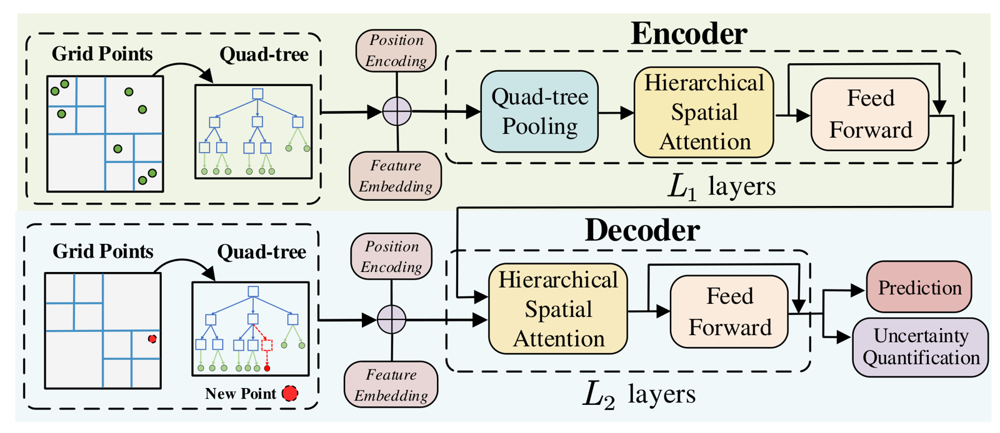
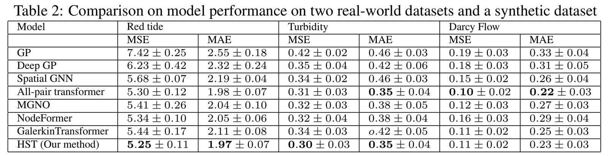
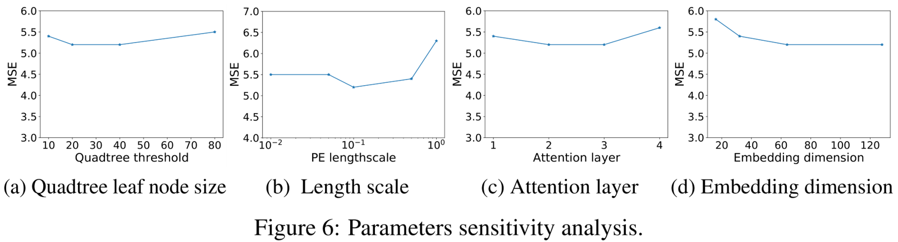
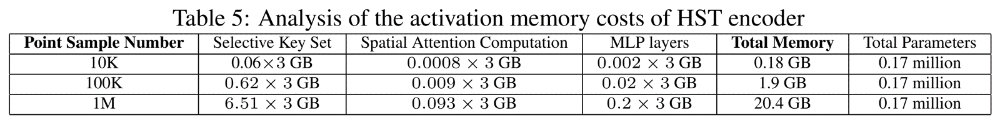

# [NeurIPS '23] A Hierarchical Spatial Transformer for Massive Point Samples in Continuous Space
This repository is the official implementation of the paper:
> **A Hierarchical Spatial Transformer for Massive Point Samples in Continuous Space** <br>
> Wenchong He<sup>1</sup>, Zhe Jiang<sup>1</sup>, Tingsong Xiao<sup>1</sup>, Zelin Xu<sup>1</sup>, Shigang Chen<sup>1</sup>, Ronald Fick<sup>2</sup>, Miles Medina<sup>2</sup>, Christine Angelini<sup>2</sup><br>
> <sup>1</sup> Dept. of Comp. & Info. Sci. & Eng., University of Florida <br>
> <sup>2</sup> Center for Coastal Solutions, University of Florida

[Paper] [\[Code\]](https://github.com/spatialdatasciencegroup/HST)

## Method Overview
> <b>Abstract</b>: Given a set of point samples in continuous space with explanatory features and target response variables, the problem is to learn the spatial structured representation of the continuous space and to infer the target variable at any new point location. The problem is fundamental with broad applications, such as coastal water quality monitoring, air quality monitoring, and operator learning on physical simulations. However, the problem is challenging due to the implicit dependency structure on irregular point locations in continuous space, the potential high computational costs of modeling long-range interactions between a large number of points, and the risks of over-confident predictions due to local point sparsity. Existing works either assume a given spatial neighbor structure or infer unknown spatial dependency under a rigid distribution assumption. In recent years, transformer architecture has been widely used to learn spatial representation, but existing methods are primarily designed for regular grids or graphs and thus cannot be directly applied to irregular point samples in continuous space. There are also works related to operator learning on numerical simulations in the continuous space, but these methods often do not address the hierarchical spatial representation of irregular points. To fill this gap, this paper proposes a new hierarchical spatial transformer model for a large number of irregular point samples in continuous space. Our key idea is to learn the multi-scale spatial representation through a quad-tree hierarchy and to conduct efficient attention operations by using a coarser representation for distant points. We also design an uncertainty quantification component to measure spatial prediction confidence. Evaluations of several datasets confirm that our method outperforms multiple baselines in existing works.
> 
<p align="center">
  
</p>

## Prepration
### Dependencies
TODO
### Dataset
TODO

## Get Started
### Training
TODO
### Testing
TODO

## Results
We provide the results on prediction performance, uncertainty quantification performance, and computation and memory cost analysis.
### Comparison on prediction performance
- prediction performance
<p align="center">
  
</p>

- sensitivity analysis
<p align="center">
  
</p>

### Comparison on uncertainty quantification performance
TODO

### Analysis on computation and memory cost

TODO: Figure 7

- activation memory costs of HST encoder
<p align="center">
  
</p>


## Citations
Please cite our paper if you find this code useful for your work:
```
@inproceedings{he2023hierarchical,
  title={A Hierarchical Spatial Transformer for Massive Point Samples in Continuous Space},
  author={He, Wenchong and Jiang, Zhe and Xiao, Tingsong and Xu, Zelin and Chen, Shigang and Fick, Ronald and Medina, Miles and Angelini, Christine},
  booktitle={Proceedings of the 2023 Conference on Neural Information Processing Systems (NeurIPS)},
  year={2023},
}
```

## Acknowledgement
TODO
